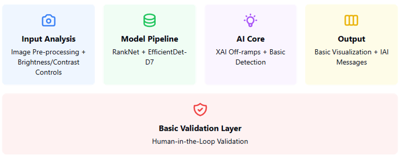

# MURDOC: Mixed Understanding and Recognition for Detection of Camouflage 
MURDOC is an application that enhances trustworthiness and explainability in computer vision models for camouflage detection through advanced XAI techniques and user-centric visualization tools.



## System Requirements
### Python Environment Setup
- Python 3.9
- Create a user environment variable named 'PythonDLL' pointing to your Python 3.9 DLL
- Required libraries and versions will be checked/installed by the provided PowerShell script

### NuGet Packages
- ImageProcessor
- pythonnet

### Models
- Place pretrained models (RankNet and EfficientDet-D7 from FACE 2023) in .\bin\x64\Debug
- Project must be built in "x64" configuration (will not run with "Any CPU")

### Installation Steps
1. Configure Python Environment:
- Create 'PythonDLL' environment variable pointing to your Python 3.9 DLL
- Update pathToVirtialEnv in MainWindowViewModel.cs InitializePythonEngine function

2. Verify Dependencies:
- Open Python Environment in Visual Studio
- Select Python 3.9 environment
- Run PowerShell script:
  ```shell
  $ "path\to\the\script\python-env-check-script.ps1"
  ```
- Script will verify/install required libraries with correct versions

3. Build Setup:
- Build project in x64 configuration
- Copy pretrained models to .\bin\x64\Debug

## 2024 Research Focus:
The project investigates two key questions:
1. How do XAI off-ramps enhance MURDOC's trustworthiness by providing transparent explanations of camouflage detection decision-making?
2. How do user-controllable image enhancements (brightness, contrast, saturation) contribute to trust, usability, and understanding?


## 2025 Research Focus:
### Trust-Driven Design for Camouflage Detection Applications
This research aims to enhance user trust and understanding in camouflage detection systems through:
- **Human Factors Evaluation**: Comprehensive study comparing FACE and MURDOC systems using TOAST scale and specialized surveys (n=240)
  - Expert users (computer programming background): 120 participants
  - Non-expert users: 120 participants
    
- **Trust-Focuses Improvements**:
  - Enhanced uncertainty visualization
  - Three-tier visualization hierarchy
  - Dynamic trust indicators
  - Integrated feedback mechanisms
    
- **Expected Outcomes**:
  - Quantitative metrics for XAI effectiveness
  - Validated design patterns for trust-aware interfaces
  - Framework for human-AI team performance evaluation

## Version History
- **v2.0** (In Development): Trust-enhanced architecture with improved visualization and user feedback systems
- **v1.0**: Initial implementation of camouflage detection with IAI/XAI integration

## License
This project is licensed under GPL-3.0 license - see the LICENSE.md file for details.

## Features
- Advanced XAI off-ramps for interpretable insights
- Attention mechanisms highlighting relevant features
- User-centric image pre-processing tools
- Interactive visualization interface
- Feature maps and activation map analysis
- Transparent decision-making process visualization

## Project Status:
This is an active research project focused on:
- Improving transparency in AI systems
- Enhancing interpretability in camouflage detection
- Developing trustworthy AI for security/defense applications
- Investigating user-driven mechanisms for model trust

## Contributing
See our paper: "MURDOC: Transforming Pixels into Perception for Camouflage Detection" for technical details and research methodology.

## Citation
If you use MURDOC in your research, please cite our paper:

```bibtex
@INPROCEEDINGS{10748781,
  author={Hogue, Debra and Kastl, Zak and Karch, Joseph and Nguyen, Don and Schley, Lacey and Lewis, Justin and Connelly, Shane and Weaver, Chris},
  booktitle={2024 AIAA DATC/IEEE 43rd Digital Avionics Systems Conference (DASC)}, 
  title={MURDOC: Transforming Pixels into Perception for Camouflage Detection}, 
  year={2024},
  pages={1-9},
  doi={10.1109/DASC62030.2024.10748781}
}
```
