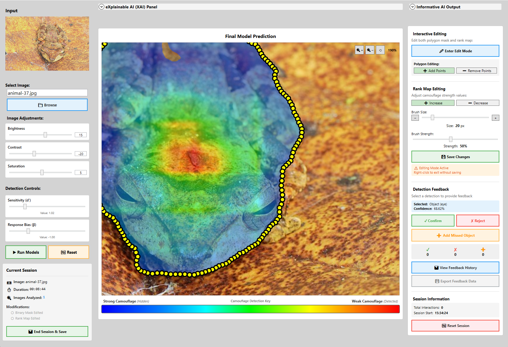

# MICA: Mixed-Initiative Camouflage Analysis Tool 
MICA is a mixed-initiative system for camouflaged object detection that combines explainable AI with interactive control mechanisms to support calibrated trust and user agency in high-uncertainty detection tasks.



## System Requirements
### Python Environment Setup
- Python 3.9
- Create a user environment variable named 'PythonDLL' pointing to your Python 3.9 DLL
- Required libraries and versions will be checked/installed by the provided PowerShell script

### NuGet Packages
- ImageProcessor
- pythonnet
- Newtonsoft.Json

### Models
- Place pretrained models (RankNet and EfficientDet-D7 from FACE 2023) in .\bin\x64\Debug
- Project must be built in "x64" configuration (will not run with "Any CPU")

### Installation Steps
1. Configure Python Environment:
- Create 'PythonDLL' environment variable pointing to your Python 3.9 DLL
- Update pathToVirtialEnv in MainWindowViewModel.cs InitializePythonEngine function

2. Verify Dependencies:
- Open Python Environment in Visual Studio
- Select Python 3.9 environment
- Run PowerShell script:
  ```shell
  $ "path\to\the\script\python-env-check-script.ps1"
  ```
- Script will verify/install required libraries with correct versions

3. Build Setup:
- Build project in x64 configuration
- Copy pretrained models to .\bin\x64\Debug

## Architecture
MICA is built on Windows Presentation Foundation (WPF) using the Model-View-ViewModel (MVVM) pattern, enabling:
- Real-time bidirectional interaction between user and AI
- Event-driven framework supporting mixed-initiative collaboration
- Modular design separating detection engine from interaction layer
- Comprehensive session tracking and analytics

## Core Features
### Interactive Editing
- Unified Edit Mode: Simultaneous polygon mask and rank map editing
- Polygon Editing: Add/remove points to refine detection boundaries
- Rank Brush Editor: Paint-based adjustments to camouflage strength values
- Real-time Feedback: Immediate visual updates during editing
- Zoom and Pan: Navigate large images while editing

### Detection Feedback
- Confirm/Reject Workflow: Explicit user validation of AI detections
- Correction Mechanism: Add the missed objects that the system failed to detect
- Feedback Analytics: Track confirmed, rejected, and corrected detections
- Session Persistence: Comprehensive logging of all user interactions

### Session Management
- Real-time Tracking: Duration, images analyzed, modifications made
- Parameter Recording: Brightness, contrast, saturation, sensitivity (d'), response bias (β)
- LoRA Training Integration: Save sessions in a format ready for model retraining
- Export Capabilities: JSON summaries with complete analysis parameters

### Explainability Features
- Layered Visualization: Original image + rank map overlay with JET colormap
- Detection Confidence Display: Visual indication of camouflage strength
- Attention Mechanisms: Highlight model focus regions
- Adjustable Parameters: User-controlled sensitivity and response bias

## Research Focus:
### Current (2025-2026): Crisis Adoption Framework
This dissertation research investigates the understanding-trust gap in AI-assisted camouflaged object detection:

### Key Research Questions:
1. Does explainability alone produce calibrated trust in high-uncertainty detection tasks?
2. How do interactive control mechanisms influence trust compared to passive transparency?
3. How does the Crisis Adoption Framework explain AI adoption under operational pressure?

### Empirical Study (Chapter 3):
- Factorial experiment comparing FACE (explainability-focused) vs. MICA (mixed-initiative)
- 150 participants across expert and non-expert cohorts
- Measures: Trust (TOAST scale), understanding, usability, perceived interactivity
- Key Finding: Interactive control produces substantially larger effects on trust than passive explainability

### Crisis Adoption Framework (Chapter 6):
- Core Thesis: "We design for deliberation, but adoption happens in crisis"
- Examines AI adoption under time pressure, cognitive load, and operational stress
- Proposes that XAI systems must be validated under conditions matching deployment contexts
- Future work: Testing trust calibration under simulated operational constraints

### Technical Contributions
- Mixed-Initiative Loop: Bidirectional interaction supporting user guidance and AI suggestions
- Signal Detection Controls: Adjustable d' (sensitivity) and β (response bias) parameters
- LoRA-Enhanced Synthesis: Controlled generation of synthetic camouflage for evaluation
- Session Analytics: Comprehensive data collection for human-AI teaming analysis

## Version History
- **v2.0** (Current - 2025): MICA framework with unified edit mode, session tracking, and Crisis Adoption Framework integration
- **v1.0** (2024): MURDOC baseline with explainability features and image adjustments

## Known Issues:
Version 2.0
- LoRA model retraining pipeline not yet implemented (session data structure prepared for future integration)
- Session tracking across application restarts requires manual session folder inspection

## Planned Features
- LoRA Training Pipeline: Automated model fine-tuning using collected session data
- Multi-User Collaboration: Team-based analysis and collective trust calibration
- Adaptive Automation: Trust-aware system behavior adjustments
- Multimodal Detection: Integration of thermal and motion-based camouflage cues

## Project Status:
Active PhD dissertation research (Expected defense: April 2026) at the University of Oklahoma, focusing on:
- Understanding-trust gap in AI-assisted decision-making
- Crisis Adoption Framework for operational AI deployment
- Mixed-initiative interaction design for high-uncertainty tasks
- Human-AI teaming in camouflaged object detection

## Contributing
This is a dissertation research project. For technical details and theoretical foundations, see our publications below.

## License
This project is licensed under the GPL-3.0 license - see the LICENSE.md file for details.

## Citation
If you use MICA in your research, please cite our papers:

### MICA Framework (2026, Under Review):
```bibtex
@article{hogue2025interactive,
  author={Hogue, Debra and Connelly, Shane and Lewis, Justin},
  journal={IEEE Access}, 
  title={Interactive Features and Trust in AI-Assisted Camouflaged Object Detection}, 
  year={2025},
  note={Under Review}
}
```

### MICA Theory (2025):
```bibtex
@inproceedings{hogue2025mica,
  title={MICA: Trust-Driven Design Refinements for Camouflaged Object Detection Applications},
  author={Hogue, Debra and Elliott, D Shane and Schley, Lacey and Lewis, Justin and Connelly, Shane and Weaver, Chris},
  booktitle={2025 AIAA DATC/IEEE 44th Digital Avionics Systems Conference (DASC)},
  pages={1--10},
  year={2025},
  organization={IEEE}
}
```

### MURDOC System (2024):
```bibtex
@INPROCEEDINGS{10748781,
  author={Hogue, Debra and Kastl, Zak and Karch, Joseph and Nguyen, Don and Schley, Lacey and Lewis, Justin and Connelly, Shane and Weaver, Chris},
  booktitle={2024 AIAA DATC/IEEE 43rd Digital Avionics Systems Conference (DASC)}, 
  title={MURDOC: Transforming Pixels into Perception for Camouflage Detection}, 
  year={2024},
  pages={1-9},
  doi={10.1109/DASC62030.2024.10748781}
}
```

## Acknowledgements
This research is supported by the DoD SMART Scholarship program and conducted in collaboration with the 557th Software Engineering Squadron. In memory of Dr. Christopher Weaver, whose mentorship and vision made this work possible.
